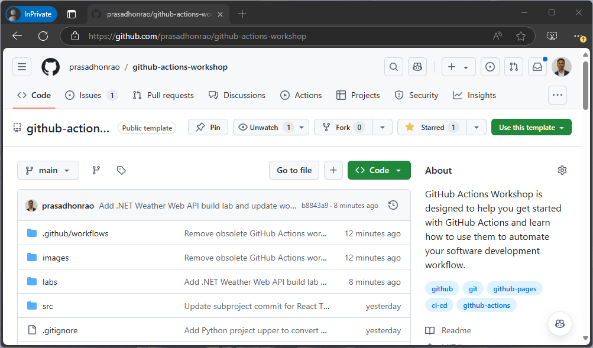
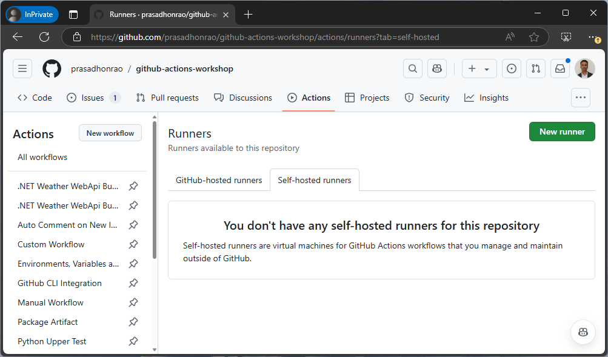
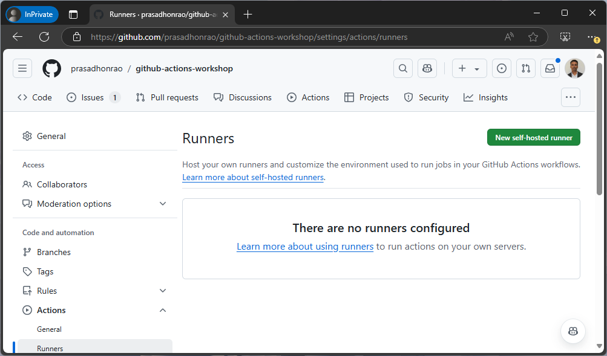
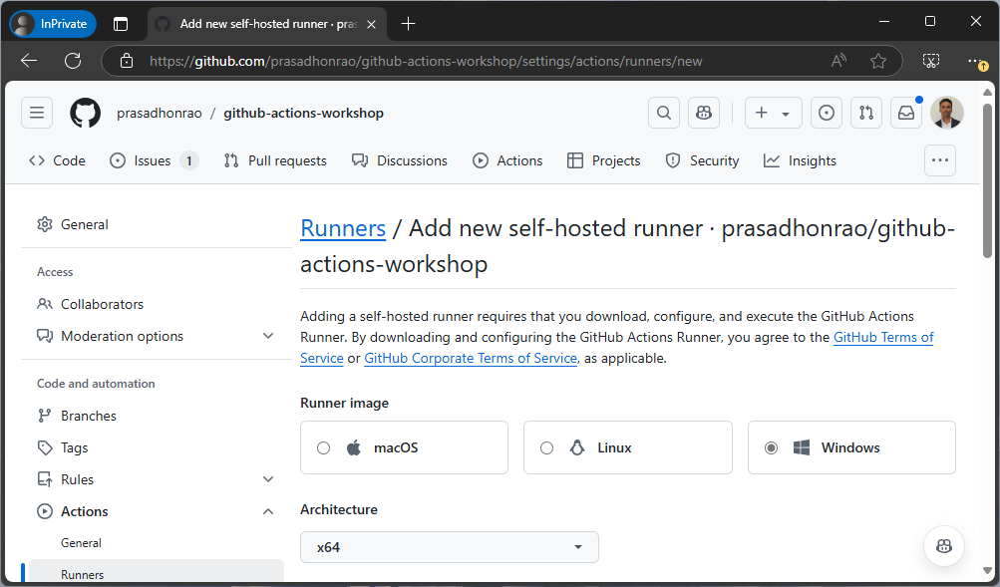
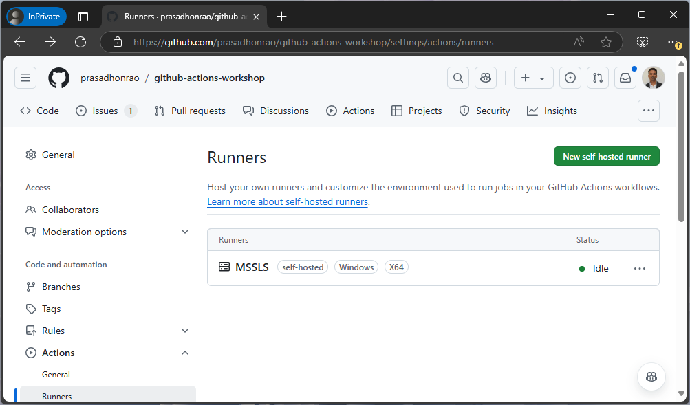

# .NET Web API Build Workflow with Self-Hosted Runner

## Introduction

In this lab, you will create a self-hosted runner and and modify existing GitHub Actions workflow to use the self-hosted runner for building the .NET Web API project.

> Duration: 30-45 minutes

## Instructions

### Create Self Hosted Runner

1. Go to your GitHub repository

   

2. Go to `Actions` tab and click on `Runners` section

   

3. Click on `Self-hosted runners` and then click on `Add Runner`

   

4. Click on `New self hosted runner` button.

   

5. Select the operating system and architecture for the runner and click on `Download` button.

   

6. Follow the instructions to configure the runner on your machine.

   

7. Once the runner is configured, you will see the runner in the list of self-hosted runners.

   

### Update Workflow for Self-Hosted Runner

1. Open the workflow file [asp.net-core-webapi-build-self-hosted-runner.yml](/.github/workflows/asp.net-core-webapi-build.yml) and update the `runs-on` attribute to use `self-hosted` runner.

```YAML
      runs-on: self-hosted
```

2. Commit the changes into the `main` branch
3. Go to `Actions` and manually trigger the workflow by clicking on `Run Workflow` button
4. See the details of your running workflow

## Solution

<details>
  <summary>asp.net-core-webapi-build.yml</summary>
  
```YAML
name: .NET Weather WebApi Build
on:
  workflow_dispatch:
  push:
    paths:
      - '.github/workflows/asp.net-core-webapi-build.yml'
      - 'src/dotnet/Weather.WebApi/**'
jobs:
  build:
    name: build
    runs-on: self-hosted
    steps:
      - uses: actions/checkout@v4
      - run: dotnet --list-runtimes
      - run: dotnet --list-sdks
      - run: dotnet build
        working-directory: ./src/dotnet/Weather.WebApi
```

</details>

## Conclusion

In this lab, you learned how to create a self-hosted runner and use it in a GitHub Actions workflow to build a .NET Web API project.

## Additional Resources

- [GitHub Actions Documentation](https://docs.github.com/en/actions)
- [GitHub Actions Self-Hosted Runners](https://docs.github.com/en/actions/hosting-your-own-runners/about-self-hosted-runners)
