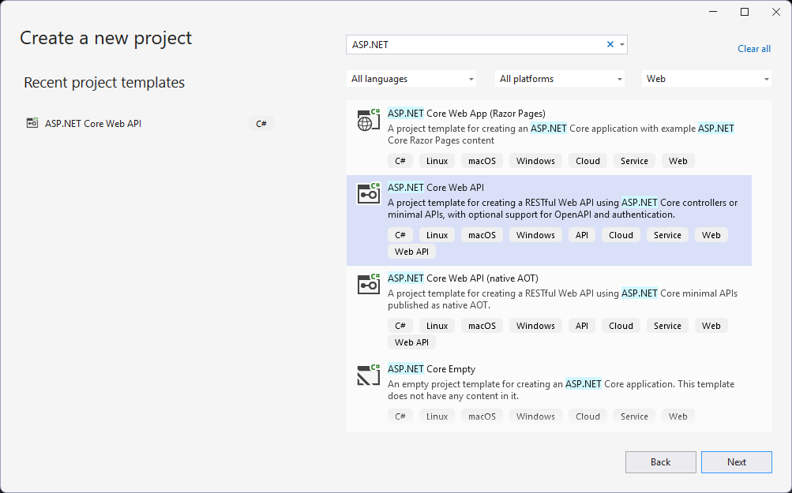
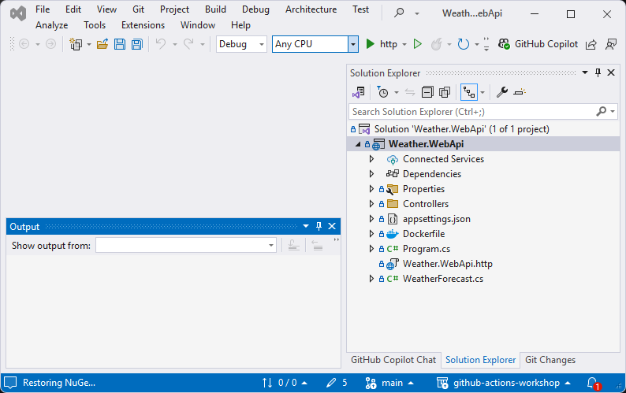
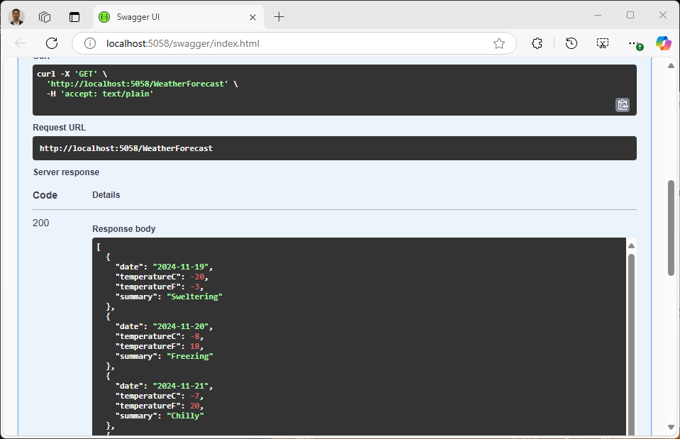

# Create an ASP.NET Core Web API Project

## Introduction

In this section, you will create a new ASP.NET Core Web API project using Visual Studio.

> **Duration**: 10-20 minutes

---

## Instructions

### Step 1: Launch Visual Studio and Start a New Project

1. Open **Visual Studio** on your computer.
2. On the welcome screen, click **Create a new project**.

   

---

### Step 2: Select the ASP.NET Core Web API Template

1. In the **Create a new project** window, search for `ASP.NET` in the template search box.
2. Select the **ASP.NET Core Web API** template from the results.
3. Click **Next** to proceed.

   

---

### Step 3: Configure the Project Name and Location

1. Enter the **Project Name** as `Weather.WebAPI`.
2. Select a suitable location for your project files using the **Location** field.
3. Click **Next**.

   

---

### Step 4: Configure Project Settings

1. In the **Additional Information** screen:
   - Ensure the target framework is set to `.NET 8 (Long-term support)` or the latest version.
   - Confirm the **Authentication Type** is set to **None**.
   - Uncheck **Enable Docker Support** (unless you need it).
2. Click **Create** to finalize the project configuration.

   

---

### Step 5: Explore the Created Project

1. Once the project is created, the solution will open in Visual Studio.
2. The project structure, including controllers and program files, will be visible in the **Solution Explorer**.

   

---

### Step 6: Run the Web API

1. Locate and click the **Run** button in Visual Studio (it will display an `http` or `https` URL).
2. The project will compile, and the API will launch in your default web browser.

   

---

### Step 7: Verify the API in the Browser

1. When the browser opens, the API’s default Swagger documentation interface will be displayed.
2. Swagger provides an interactive UI to test your API endpoints.

   

---

### Step 8: Test the Weather API Endpoint

1. Use the Swagger UI to test the API. Expand the **WeatherForecast** endpoint.
2. Click the **Try it out** button, followed by **Execute** to send a test request.
3. Verify the API’s response in the **Response Body** section.

   

---

## Summary

You have successfully created an ASP.NET Core Web API project, launched it in the browser, and tested it using Swagger UI. The Weather API is now ready for further development and integration.
