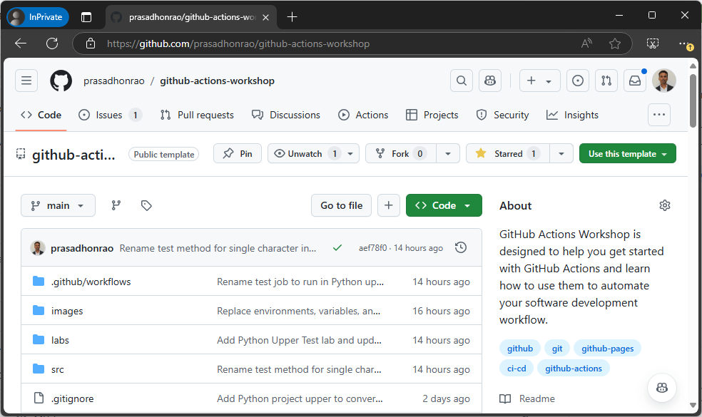
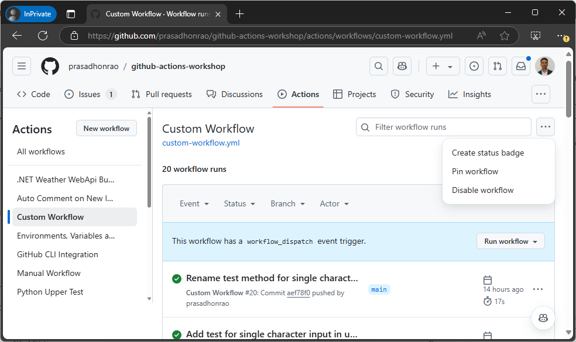
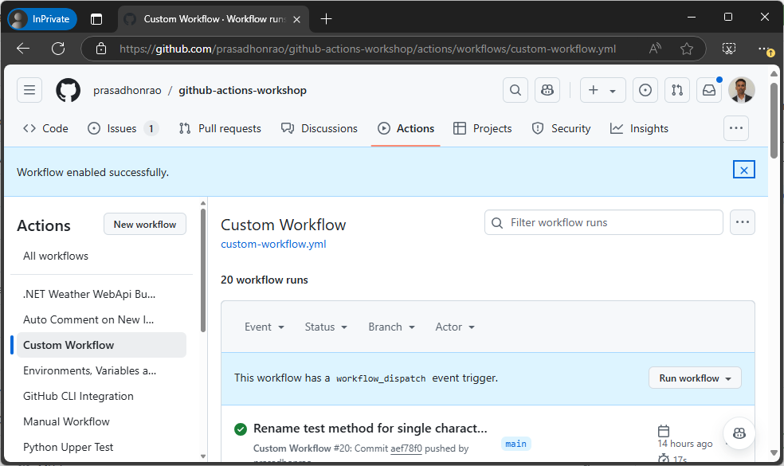

# Disabling a Workflow

## Introduction

In this lab, you will learn how to disable a workflow in a GitHub repository. This is useful when you want to temporarily stop a workflow from running and you don't want to delete the workflow file.

## Instructions

1. Go to your GitHub repository.

   

2. Go to `Actions` tab.

   

3. Click on the workflow you want to disable.

   

4. Click on the Ellipsis icon and then click on `Disable workflow`.

   

5. The workflow will be disabled and you will see a message that the workflow is disabled.

   

6. Workflow is now disabled and it will not run automatically when the event occurs.

   

7. To re-enable the workflow, click on the workflow and then click on `Enable workflow` button. It will show a message that the workflow is enabled.

   

## Conclusion

In this lab, you learned how to disable a workflow in a GitHub repository. This is useful when you want to temporarily stop a workflow from running and you don't want to delete the workflow file.

## Additional Resources

- [GitHub Actions Documentation](https://docs.github.com/en/actions)
- [Disabling and enabling workflow](https://docs.github.com/en/actions/managing-workflow-runs/disabling-and-enabling-a-workflow)
