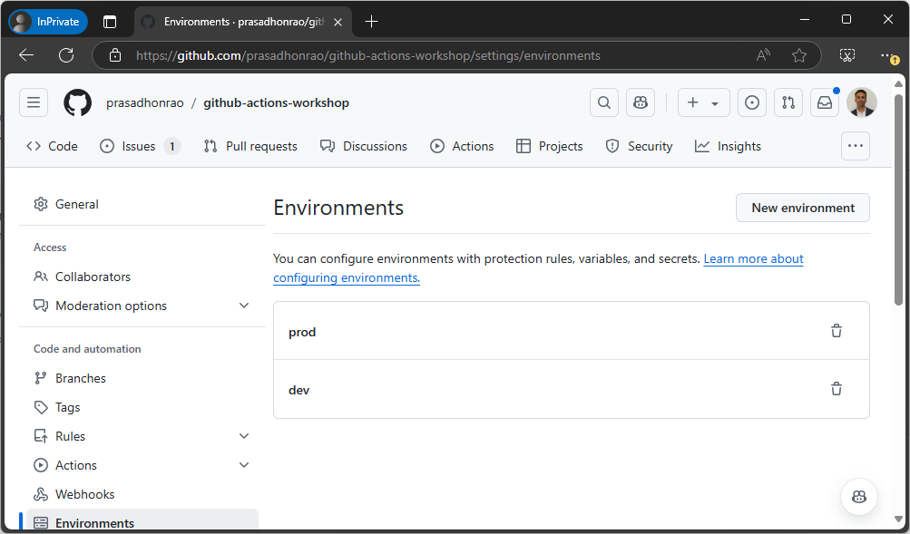
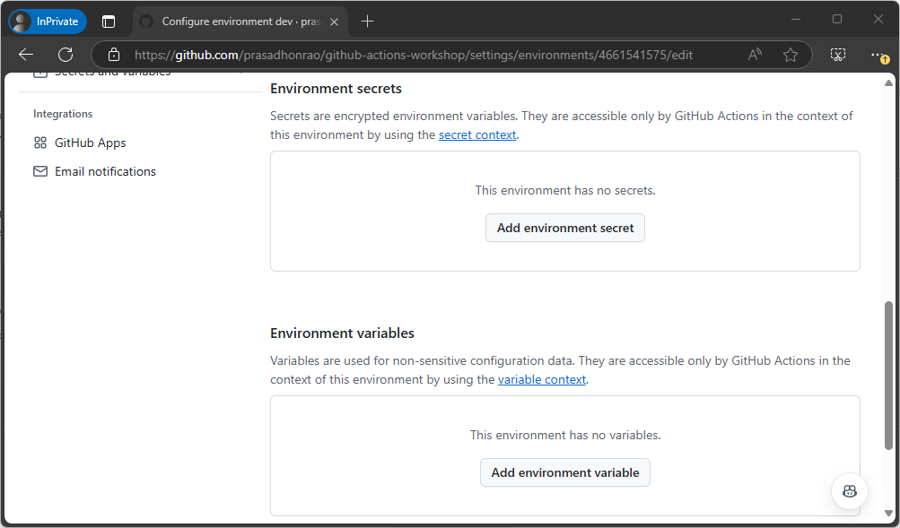
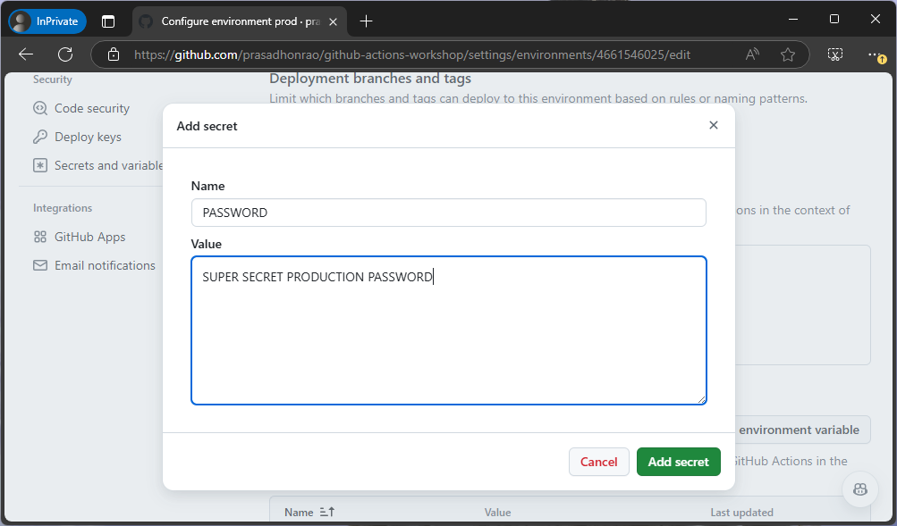
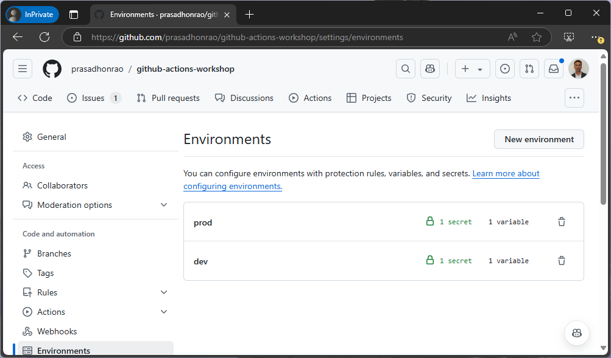
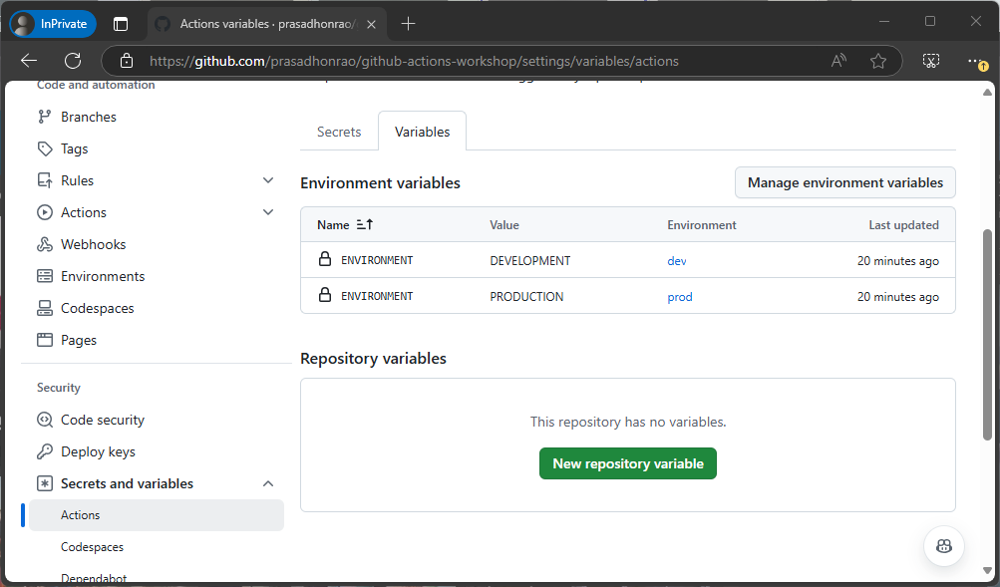
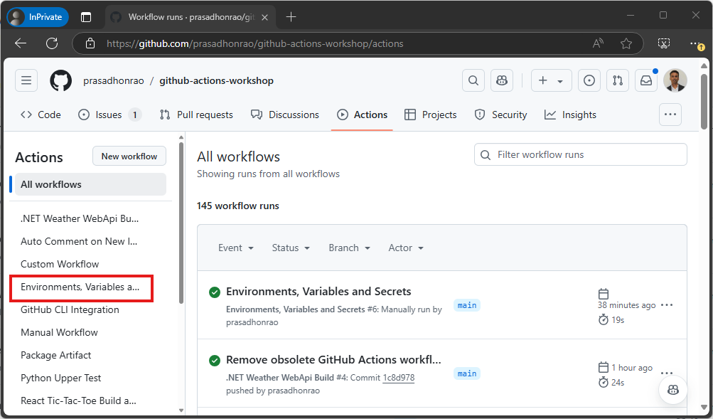
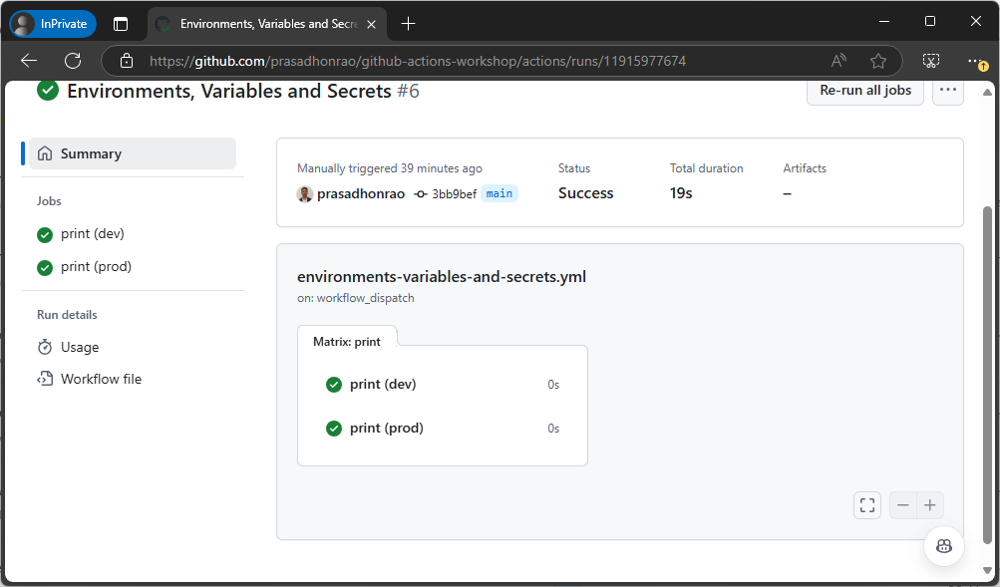

# Environments, Variables, and Secrets Lab

## Introduction

In this lab, you will learn how to set up different environments in GitHub and how to use environment variables and secrets. You will also learn how to reference those variables and secrets in your workflows.

> **Estimated Duration**: 30-40 minutes

---

## Instructions

### Step 1: Create Environments

1. **Go to your repository** on GitHub.

   

2. **Click on the `Settings` tab** and navigate to the `Environments` section on the left sidebar.

   

3. **Click on `Environments`**. This will show you the list of environments, which should be empty if you have not created any environments earlier.

   

4. **Click on `New environment`** button.

   

5. **Enter the environment name** as `dev` and click the `Create environment` button.

6. Repeat steps 4 and 5 to create another environment named `prod`. You should now see both the `dev` and `prod` environments in the list.

   

---

### Step 2: Add Environment Variables

1. Select the `dev` environment and scroll down to the **Environment variables** section. Click on the **Add environment variable** button.

   

2. **Enter the name** as `ENVIRONMENT` and the value as `DEVELOPMENT`. Click the **Add variable** button.

   

3. Repeat steps 1 to 3 for the `prod` environment, but with the value set to `PRODUCTION`.

   

4. Both environment variables should now be added to their respective environments.

   

---

### Step 3: Add Environment Secrets

1. Select the `dev` environment again and scroll down to the **Environment secrets** section. Click the **Add environment secret** button.

   

2. **Enter the name** as `SECRET` and the value as `SUPER SECRET DEV PASSWORD`. Click the **Add secret** button.

   

3. Repeat steps 1 to 3 for the `prod` environment, but with the value set to `SUPER SECRET PROD PASSWORD`.

   

4. The environment secrets should now be added to their respective environments.

   

---

### Step 4: Add Repository Variables

1. Go to your repository’s **Settings** tab and navigate to **Secrets and variables** on the left sidebar.

   

2. Click on the **New repository variables** button.

   

3. **Enter the name** as `REPOSITORY_VARIABLE` and the value as `repository-variable`. Click the **Add variable** button.

   

---

### Step 5: Create a YAML Workflow Using the Starter File

1. Navigate to the Env Var and Secrets Starter File.

2. Copy the content of the starter file:

   ```yaml
   Copy code
   name: Env Var and Secrets
   ```

3. In your repository, create a new workflow file under .github/workflows and name it env-var-secrets.yml.

4. Paste the copied content into the new file.

5. Commit the workflow file to the main branch.

---

### Step 6: Use Environment Variables and Secrets in Workflows

1. Open the workflow file `[environments-and-secrets.yml](/.github/workflows/environments-variables-and-secrets.yml)` in your repository.

2. Since we have created multiple environments, we use a **matrix strategy** to run the workflow for each environment.

   ```yaml
   strategy:
     matrix:
       environment: [dev, prod]
   ```

3. Set the context for the environment variables and secrets in the job by using:

   ```yaml
   environment: ${{ matrix.environment }}
   ```

4. To access the **environment variables** in your workflow, use the following syntax:

   ```yaml
   - name: Display Environment Variable
     run: |
       echo "Building for environment: ${{ matrix.environment }}"
       echo "ENVIRONMENT_NAME: $ENVIRONMENT"
       echo "ENVIRONMENT_NAME length: ${#ENVIRONMENT}"
       echo "ENVIRONMENT_NAME (partial): ${ENVIRONMENT:0:5}..."
     env:
       ENVIRONMENT: ${{ vars.ENVIRONMENT }}
   ```

5. To access the **environment secrets**, use the following syntax:

   ```yaml
   - name: Display Environment Secret
     run: |
       echo "SECRET length: ${#SECRET}"
     env:
       SECRET: ${{ secrets.SECRET }}
   ```

6. To access the **repository variables**, use this syntax:

   ```yaml
   - name: Display Repository Variable
     run: |
       echo "REPOSITORY_VARIABLE: ${{ vars.REPOSITORY_VARIABLE }}"
   ```

---

### Step 7: Run the Workflow

1. Go to the **Actions** tab in your repository and click on the workflow **Environments, Variables, and Secrets** on the left sidebar.

   

2. Let the workflow run for both the `dev` and `prod` environments.

   

3. Click on the workflow run and check the logs for the environment variables, secrets, and repository variables.

   

---

## Summary

In this lab, you learned how to:

1. Create environments in GitHub.
2. Add environment variables and secrets to those environments.
3. Use environment variables, secrets, and repository variables in your workflows.
4. Run a workflow for multiple environments and check the logs for proper variable usage.

---

## Additional Resources

- [Using environments for deployment](https://docs.github.com/en/actions/deployment/targeting-different-environments/using-environments-for-deployment)
- [Encrypted secrets](https://docs.github.com/en/actions/security-guides/encrypted-secrets)
- [Accessing your secrets](https://docs.github.com/en/actions/security-guides/encrypted-secrets#accessing-your-secrets)
