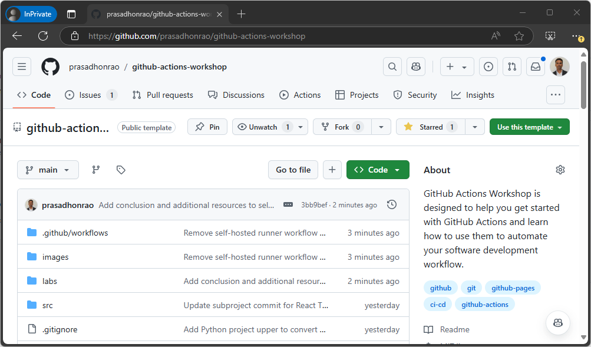
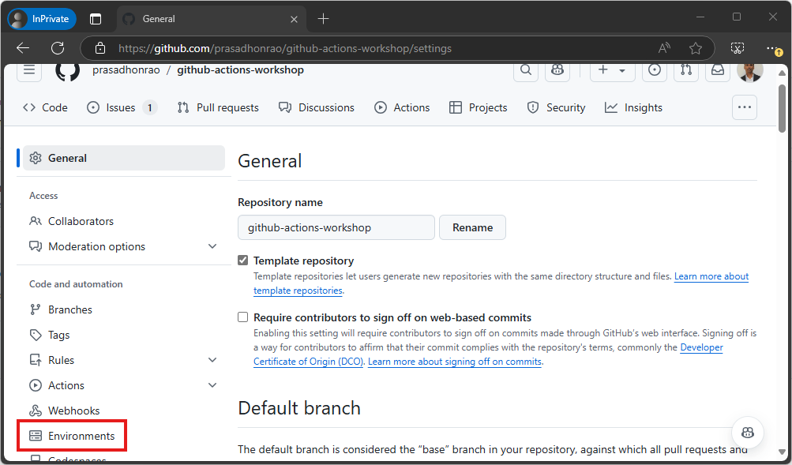
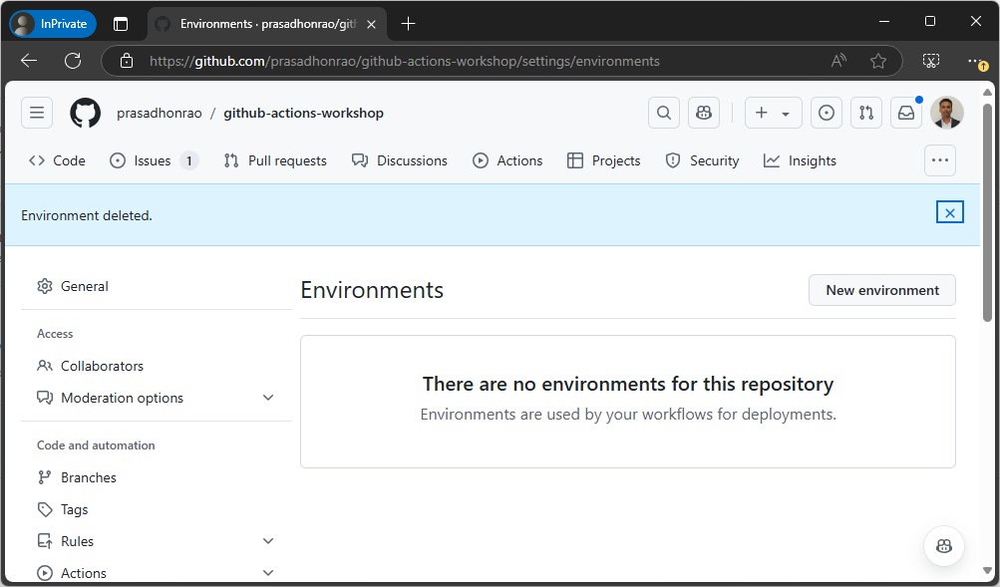
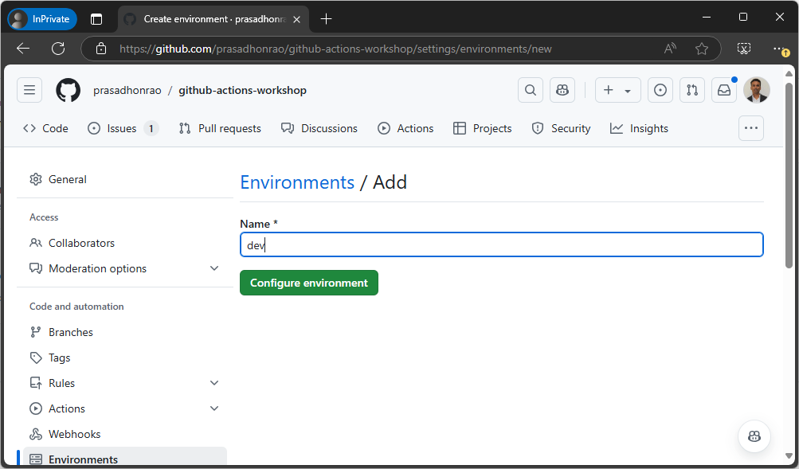
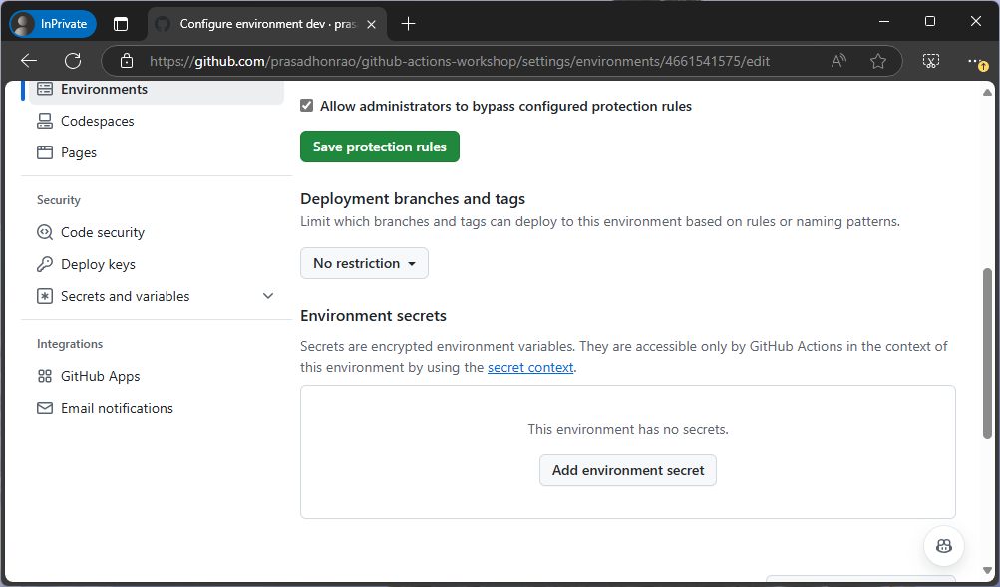

# Environments, Variables and Secrets

## Introduction

In this lab, you will learn how to setup different environments in GitHub and how to use environment variables and secrets. You will also learn how to use those variables and secrets in your workflows.

## Instructions

### Create Environments

1. Go to your repository on GitHub

   

2. Click on `Settings` tab and navigate to `Environments` on the left sidebar

   

3. Click on `Environments` on the left sidebar. This will show you the list of environments which should be empty if you have not created any environment earlier.

   

4. Click on `New environment` button

   

5. Enter the environment name as `dev` and click on `Create environment` button

6. Repeat steps 4 and 5 to create `prod` environment. You should see two environments `dev` and `prod` in the list.

   

## Add Environment Variables

1. Select `dev` environment and scroll to `Environment variables` section and click on `Add environment variable` button

   

2. Enter the name as `ENVIRONMENT` and value as `DEVELOPMENT` and click on `Add variable` button

   

3. Repeat steps 1 to 3 for `prod` environment with value as `PRODUCTION`

   

4. The environment variables should be added to the respective environments
   

## Add Environment Secrets

1. Select `dev` environment and scroll to `Environment secrets` section and click on `Add environment secret` button

   

2. Enter the name as `SECRET` and value as `SUPER SECRET DEV PASSWORD` and click on `Add secret` button

   

3. Repeat steps 1 to 3 for `prod` environment with value as `SUPER SECRET PROD PASSWORD`

   

4. The environment secrets should be added to the respective environments

   

## Add Repository Variables

1. Go to your repository `Settings` tab and navigate to `Secrets and variables` on the left sidebar

   

1. Click on `New repository variables` button

   

1. Enter the name as `REPOSITORY_VARIABLE` and value as `repository-variable` and click on `Add variable` button

   

## Use Environment Variables and Secrets in Workflows

1. Open the workflow file [environments-and-secrets.yml](/.github/workflows/environments-variables-and-secrets.yml)

2. Note that since we have created multiple environments, we have used `matrix` strategy to run the workflow for each environment

   ```YAML
   strategy:
      matrix:
        environment: [dev, prod]
   ```

3. Then we set the context for the environment variables and secrets in the job

   ```YAML
   environment: ${{ matrix.environment }}
   ```

4. We can access the environment variables using the following syntax

   ```YAML
   - name: Display Environment Variable
      run: |
         echo "Building for environment: ${{ matrix.environment }}"
         echo "ENVIRONMENT_NAME: $ENVIRONMENT"
         echo "ENVIRONMENT_NAME length: ${#ENVIRONMENT}"
         echo "ENVIRONMENT_NAME (partial): ${ENVIRONMENT:0:5}..."
      env:
         ENVIRONMENT: ${{ vars.ENVIRONMENT }}
   ```

5. We can access the environment secrets using the following syntax

   ```YAML
    - name: Display Environment Secret
        run: |
          echo "SECRET length: ${#SECRET}"
        env:
          SECRET: ${{ secrets.SECRET }}
   ```

6. Repository variables can be access using following syntax

   ```YAML
   - name: Display Repository Variable
       run: |
         echo "REPOSITORY_VARIABLE: ${{ vars.REPOSITORY_VARIABLE }}"
   ```

## Run the Workflow

1. Go to the `Actions` tab and click on the workflow `Environments, Variables and Secrets` on the left sidebar

   

2. Let the workflow run for both `dev` and `prod` environments

   

3. Click on the workflow run and check the logs for the environment variables, secrets and repository variables

   

## Conclusion

In this lab, you learned how to create environments in GitHub, how to add environment variables and secrets to the environments and how to use them in your workflows.

## Additional Resources

- [Using environments for deployment](https://docs.github.com/en/actions/deployment/targeting-different-environments/using-environments-for-deployment)
- [Encrypted secrets](https://docs.github.com/en/actions/security-guides/encrypted-secrets)
- [Accessing your secrets](https://docs.github.com/en/actions/security-guides/encrypted-secrets#accessing-your-secrets)
