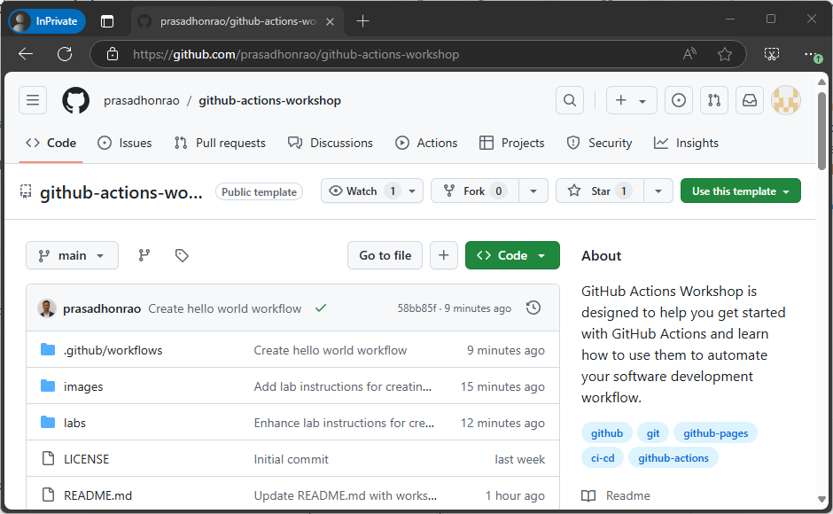
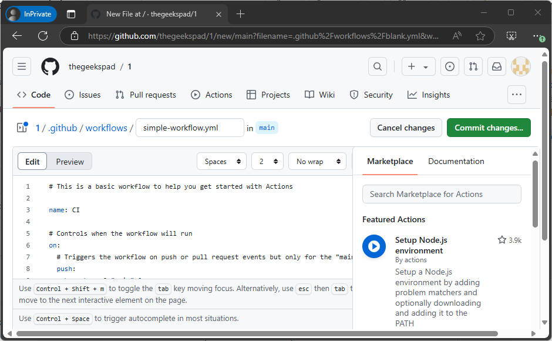
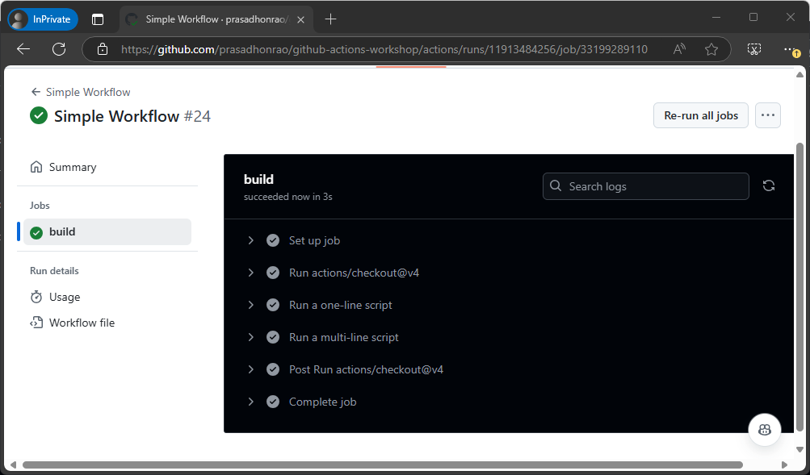

# Simple Workflow

## Introduction

In this lab, you will create a simple workflow that runs on every push to the repository. The workflow will echo a message to the console.

> Duration: 10-15 minutes

## Instructions

1. Navigate to the repository you created in the previous lab.

   

2. Navigate to `Actions` tab.

   

3. Click on the `New workflow` button.

   

4. Select `Simple workflow` template and click on `Configure` button

   

5. Enter the workflow name as `simple-workflow.yml` and click on `Commit changes...` button

   

6. This will create a new file `.github/workflows/simple-workflow.yml` in your repository

   

7. Navigate to Actions tab and you will see the workflow in the list.

   

8. Click on `Run workflow` button and select `main` branch and click on `Run workflow` button

   

9. This will trigger the workflow and you will see the workflow running. Click on the workflow run to see the details of the workflow run.

   

## Workflow Code

The complete workflow code is shown below.

```YAML

# This is a basic workflow to help you get started with Actions

name: Simple Workflow

# Controls when the workflow will run

on:

# Triggers the workflow on push or pull request events but only for the "main" branch

# push:

# branches: ['main']

# pull_request:

# branches: ['main']

# Allows you to run this workflow manually from the Actions tab

workflow_dispatch:

# A workflow run is made up of one or more jobs that can run sequentially or in parallel

jobs:

# This workflow contains a single job called "build"

build: # The type of runner that the job will run on
runs-on: ubuntu-latest

    # Steps represent a sequence of tasks that will be executed as part of the job
    steps:
      # Checks-out your repository under $GITHUB_WORKSPACE, so your job can access it
      - uses: actions/checkout@v4

      # Runs a single command using the runners shell
      - name: Run a one-line script
        run: echo Hello, world!

      # Runs a set of commands using the runners shell
      - name: Run a multi-line script
        run: |
          echo Add other actions to build,
          echo test, and deploy your project.

```

## Summary

In this lab, you created a simple workflow that runs on every push to the repository. The workflow echoed a message to the console.

## Additional Resources

1. [GitHub Actions Documentation](https://docs.github.com/en/actions)
