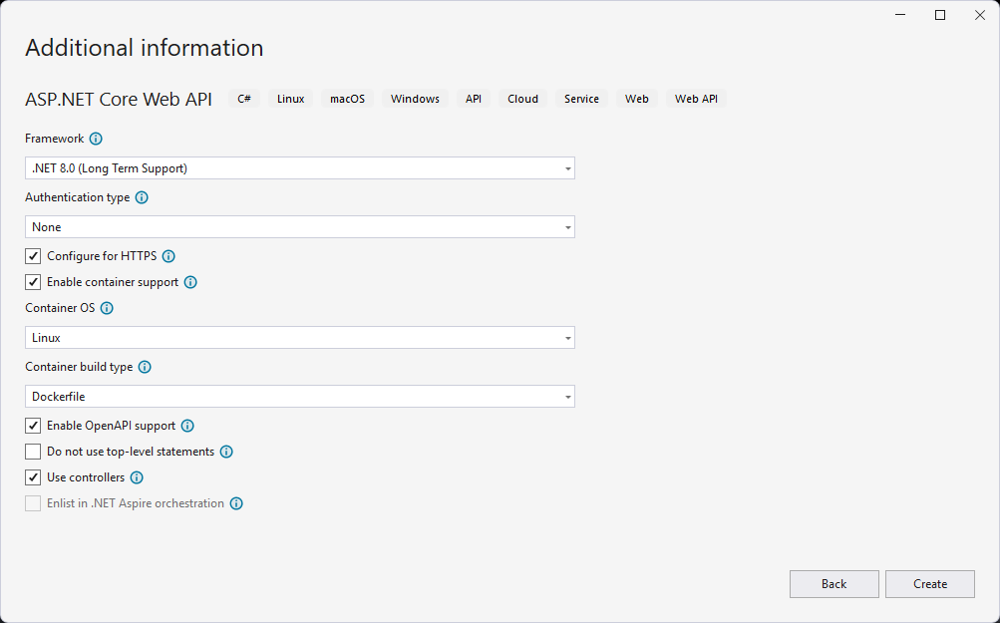
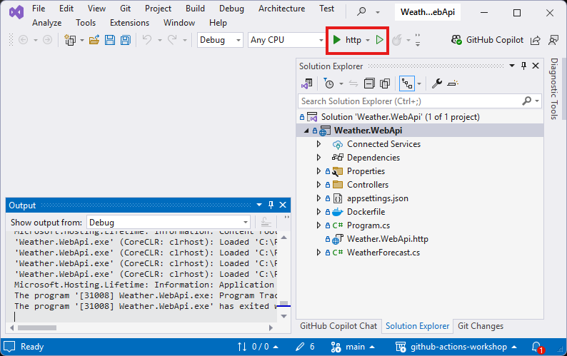

# Web API Build

## Introduction

In this lab, you will create a workflow to build ASP.NET Core Web API project using GitHub Actions. You will learn how to create a workflow file, define jobs and steps, and run the workflow on different runners.

> Duration: 20-30 minutes

## Instructions

### Create ASP.NET Core Web API Project

1. Launch Visual Studio and select `Create a new project` option.

   

2. Search for `ASP.NET` template and select `ASP.NET Core Web API` template.

   

3. Enter the project name as `Weather.WebAPI` and click on `Next` button.

   

4. Provide additional information as shown below and click on `Create` button.

   

5. The project will be created and displayed in Visual Studio.

   

6. Run the project by clicking on the `http` button.

   

7. The project will be launched in the browser.

   

8. Test the API using the Swagger UI and verify the response.

   [Test API](../images/webapi/8.png)

### Create Workflow

1. Open the workflow file [webapi-build.yml](/.github/workflows/webapi-build.yml) and copy the following YAML content in `jobs` section

   ```YAML
   build:
   name: build
   runs-on: ubuntu-latest
   steps:
     - uses: actions/checkout@v4
   	 - run: dotnet --list-runtimes
   	 - run: dotnet --list-sdks
   	 - run: dotnet build
   	 	 working-directory: ./src/dotnet/Weather.WebApi
   ```

2. Commit the changes into the `main` branch
3. Go to `Actions` and manually trigger the workflow by clicking on `Run Workflow` button
4. See the details of your running workflow

### Configure Workflow to Run on Windows Runner

1. Open the workflow file [webapi-build.yml](/.github/workflows/webapi-build.yml) and change the `runs-on` value to `windows-latest`

   ```YAML
   runs-on: windows-latest
   ```

2. Commit the changes into the `main` branch
3. Go to `Actions` and manually trigger the workflow by clicking on `Run Workflow` button
4. See the details of your running workflow and verify the build is running on Windows runner

### Configure Workflow to Run on MacOS Runner

1. Open the workflow file [webapi-build.yml](/.github/workflows/webapi-build.yml) and change the `runs-on` value to `macos-latest`

   ```YAML
   runs-on: macos-latest
   ```

2. Commit the changes into the `main` branch
3. Go to `Actions` and manually trigger the workflow by clicking on `Run Workflow` button
4. See the details of your running workflow and verify the build is running on MacOS runner

## Summary

Congratulations! You have successfully created a workflow to build ASP.NET Core Web API project using GitHub Actions.

## Additional Resources

- [GitHub Actions Documentation](https://docs.github.com/en/actions)
